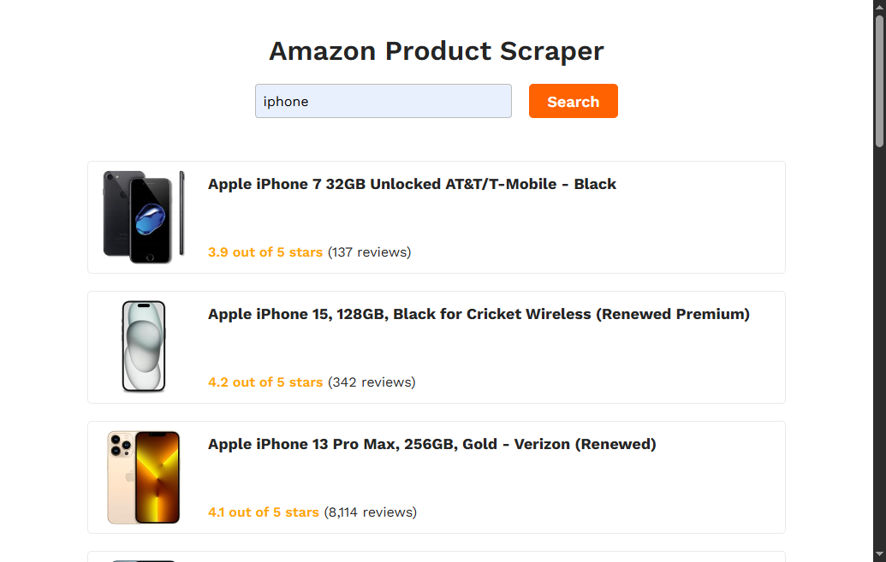

# 🛒 Amazon Product Scraper - Full Stack



This project is a full-stack application that allows users to search for Amazon products by keyword. The application consists of two parts:

- **Back-end:** An Express API running on Bun that scrapes Amazon listings.
  - See more about the **back-end** by clicking [here](./back-end/README.md)
- **Front-end:** A simple web interface that allows the user to search and view the results.
  - See more about the **front-end** by clicking [here](./front-end/README.md)


## 🚀 Technologies Used

### 🔙 Backend

- **Bun** – Ultra-fast JavaScript runtime
- **Express** – Minimalist web framework
- **Axios** – HTTP client for requests
- **JSDOM** – DOM simulator in Node/Bun environments
- **RandomUseragent** – Avoids repetition of User-Agents
- **CORS** – Allows communication between front-end and back-end

### 🔜 Front-end

- **HTML5** – Page structuring
- **CSS3** – Styling
- **JavaScript** – Interaction and dynamic requests
- **Vite** – Build tool and local server

## 📁 Project Structure

```
amazon-scraper-app/
├── back-end/
│   ├── src/
│   │   └── index.js
│   ├── .gitignore
│   ├── bun.lockb
│   ├── package.json
│   └── README.md
└── front-end/
    ├── public/
    │   ├── loading.gif
    │   └── logo.svg
    ├── src/
    │   ├── main.js
    │   └── style.css
    ├── index.html
    ├── package.json
    └── README.md
```

## ⚙️ How to Run

### 1. Prerequisites

- Have [Node.js](https://nodejs.org/) installed.
- Have [Bun](https://bun.sh) installed:
```bash
curl -fsSL https://bun.sh/install | bash
```

### 2. Clone the Repository

```bash
git clone https://github.com/matheusfdosan/amazon-scraper-app.git
cd amazon-scraper-app
```

### 3. Start the Backend

```bash
cd back-end
bun install
bun run start
```

The server will be available at: `http://localhost:3000/api/scrape?keyword=palavra-chave`

### 4. Start the Front-end

```bash
cd ../front-end
bun install
bun run dev
```

Open your browser to `http://localhost:5173`

## 📌 How to Use

- Go to the front-end page.
- Enter a keyword (e.g. "headphones").
- Click "Search".
- The results will be displayed with:
  - **Product Title**
  - **Rating (stars)**
  - **Number of Reviews**
  - **Product Image**

## ☝️ Technical Notes

Amazon scraping presents challenges due to automated blocks such as CAPTCHAs and 503 response codes. To overcome this, techniques such as:

- Headers with random User-Agents
- Dynamic parameters such as `qid` and `xpid` simulating human access
- Delay between requests
- Response caching to reduce repeated accesses

## 👨‍💻 Author

Developed by [Matheus Faustino](https://github.com/matheusfdosan)
